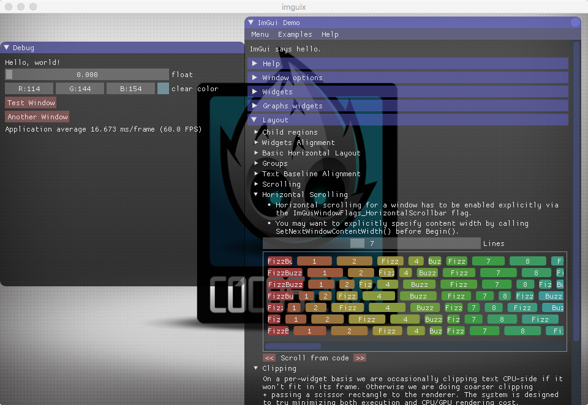

## cocos2d-x-3.14.1 with imgui

1. [https://github.com/cocos2d/cocos2d-x](https://github.com/cocos2d/cocos2d-x)
2. [https://github.com/ocornut/imgui](https://github.com/ocornut/imgui)




## how to integrate imguix

* all you need are `Classes/CCImGui` folder
* Create GLView:

```cpp
// include headers
#if (CC_TARGET_PLATFORM == CC_PLATFORM_WIN32) || (CC_TARGET_PLATFORM == CC_PLATFORM_MAC)
#include "CCIMGUIGLViewImpl.h"
#include "CCImGuiLayer.h"
#endif
```

```cpp
// create glview
director->setOpenGLView(IMGUIGLViewImpl::createWithRect("imguix", Rect(0, 0, width,   height)));
```

```cpp
// add imgui layer on the top
#if (CC_TARGET_PLATFORM == CC_PLATFORM_WIN32) || (CC_TARGET_PLATFORM == CC_PLATFORM_MAC)
// ImGui is always on the top
Director::getInstance()->getScheduler()->schedule([](float)
	{
	if (!Director::getInstance()->getRunningScene()->getChildByName("ImGUILayer"))
	{
	Director::getInstance()->getRunningScene()->addChild(ImGuiLayer::create(), INT_MAX,   "ImGUILayer");
	}
	}, this, 0, false, "checkImGUI");
#endif
```

## how to use

```c++
// add ui
CCIMGUI::getInstance()->addImGUI([=](){
		{
		ImGui::Text("Hello, world!");
		}
		}, "demoid");

// remove ui
CCIMGUI::getInstance()->removeImGUI("demoid");

// create button with file name, auto pushID / popID with texture id
CCIMGUI::getInstance()->imageButton("filename.png");

// create button with SpriteFrameName, auto pushID / popID with texture id
CCIMGUI:: getInstance()->imageButton("#framename");

// chinese font
// http://www.slackware.com/~alien/slackbuilds/wqy-zenhei-font-ttf/build/wqy-zenhei-0.4.23-1.tar.gz
ImGuiIO &io = ImGui::GetIO();
io.Fonts->AddFontFromFileTTF("res/wqy-zenhei.ttf", 18.0f, 0, io.Fonts->GetGlyphRangesChinese());
```

## How to compile

* Clone this repository
* Create a new Cocos2D-X C++ project
* Copy and replace the contents of this repository into the new project
* Compile and run:
* Linux: `cocos run -p linux`
* Mac: `cocos run -p mac`
* Windows: `cocos run -p win32`

## TODO:

* Merge android support - previously implemented  by @namkazt -> https://github.com/namkazt/imguix
* Add iOS support.
